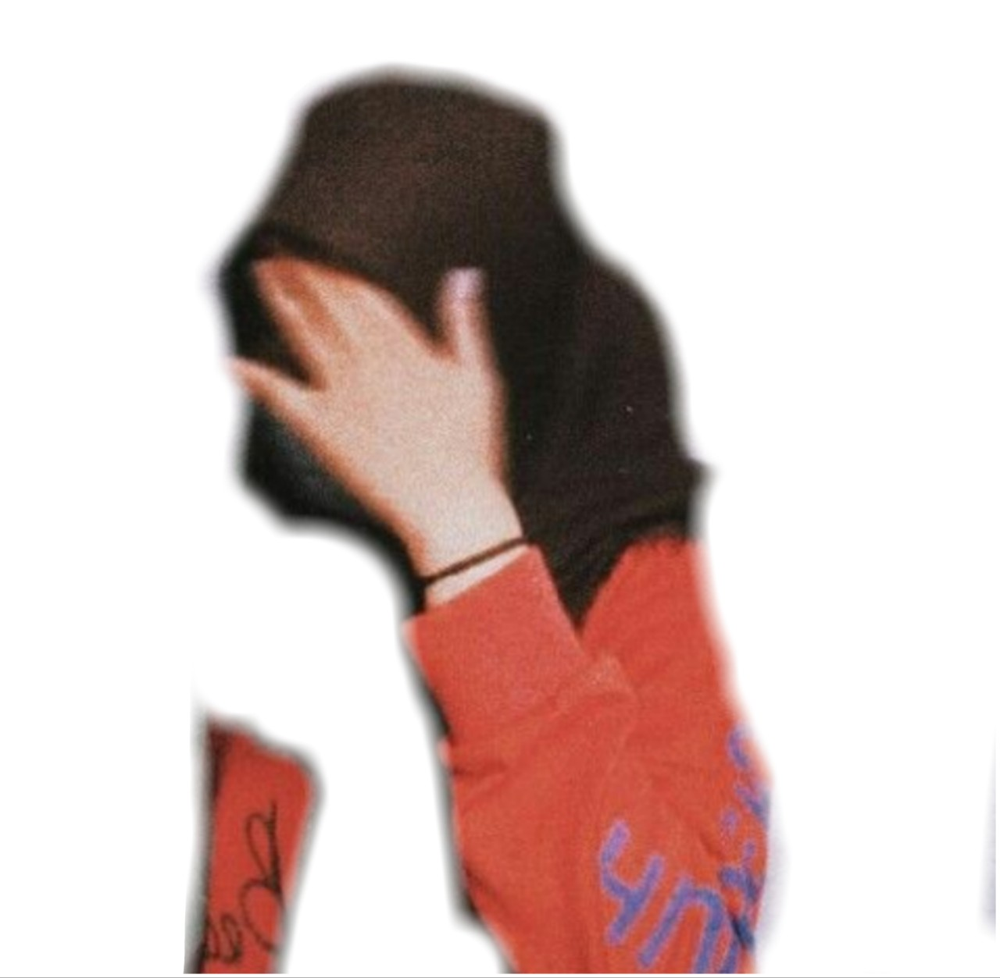
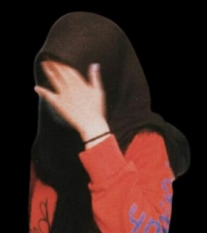

---

## PACKAGE
```
https://npmjs.com/package/removebg-id
```

## INFORMASI
```
client.FromPath | function(path, apikey)
client.FromUrl  | function(url, apikey)
```

## INSTALL VIA NPM
```
npm i removebg-id
```

## RUN PACKAGE
```javascript
var Remove = require('removebg-id');

// FROM PATH
Remove.FromPath(path, apikey)

// FROM URL
Remove.FromUrl(Url, apikey)
```

## CASE BOT? WHATSAPP?
```javascript
const Removebg = require('removebg-id');

case 'removebg':
if ((isMedia && !mek.message.videoMessage || isQuotedImage) && args.length == 0) {
const encmedia = isQuotedImage ? JSON.parse(JSON.stringify(mek).replace('quotedM','m')).message.extendedTextMessage.contextInfo : mek
const media = await client.downloadAndSaveMediaMessage(encmedia)
Removbg.FromPath(media, apikey)
client.sendMessage(from, fs.readFileSync('./hasil-path.png'), image, {quoted: mek, caption: 'NIH'})
break
```

## GET APIKEY? ( FREE COK )
```
https://www.remove.bg/api
```

## DETAIL HASIL NYAB
ini adalah hasil yang v lama 



hasil nya benar benar kurang bagus , dan di update ini kita 
berhasil mengembangkan lagi agar lebih smooth

ini adalah hasil v terbaru



dengan demikian hasil nya akan lebih smooth saran gunakan apikey : 2mZbr62TiNKYw3rFPPtb4BYn

